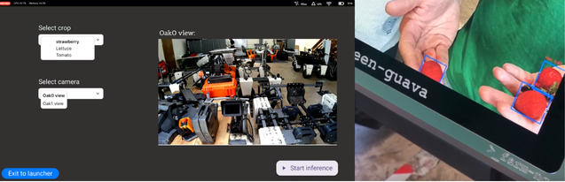

# <center>AgroVision: A crop-detection application for precision-farming with Amiga</center> 



## 📌 Introduction
 It is an app for the amiga which can help farmers to enhance their farm output by providing them valuable insights about their field, spanning from classificatio between mature and immature crops, to detecting weeds or pests.

## 🖥️ Technologies

- ### For training the model:
    - Google Colab
    - Ultralytics
    - ClearML
- ### For deploying on the brain(Jetson Xavier NX):
    - JetPack SDK(v5.1.b147)
    - farm-ng-amiga(v2.3.1)
    - farm-ng-core(v2.3.0)
    - farm-ng-package(0.1.3)
    - onnx(v1.16.3)
    - OpenCV-python(v4.10.0.84)
    - Numpy(v1.24.4)
    - PyCuda(v2024.1)
    - Python(v3.8)
    - setuptools(v71.1.0)
    - torch(v2.0.0+nv23.5)
    - torchvision(v0.15.1)
    - Ultralytics
    - npm(v10.8.2)
    - nvm(v0.39.7)
    - FastAPI

## 🚥 Running the Project
### To run the project on the brain of Amiga, follow these steps:
- Use your SSH credentials to SSH to one of the Amiga's, using 
```bash
ssh <brain-name> 
```
- Switch to your user profile on the brain
```bash
cd /mnt/managed_home/farm-ng-user-<username>
```
- Create a python virtual enviornment, using 
```bash
python -m venv <virtual-env-name>
```
- Activate the virtual enviornment
```bash
source <virtaul-env-name>/bin/activate
```
- Clone the Farmng-crop-detection repository
```bash
git clone --branch master https://github.com/Sapienscoding/Farmng-crop-detection.git
```
- Change to repo directory
```bash
cd Farmng-crop-detection
```
- Install the dependencies
```bash
pip -r install requirement.txt
```
- To run the inference on the brain
```python
python test.py --service-config service_config.json --model-path yv8_64.engine
```

## 🪄 Improvements
- Making dataset more robust, in distinguishing which one is strawberry and which one is not 
- Training the model for other crops
- Extracting insightful data for users to visualize.
- Geo-tagging the detections

